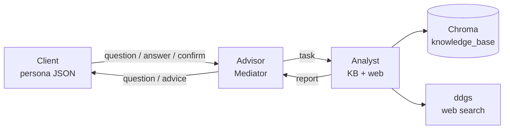
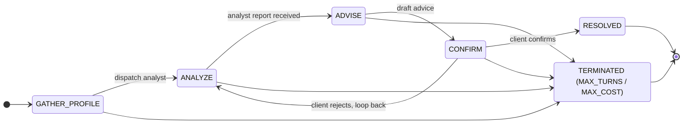

# JPM Multi-Agent Financial Advisor

A LangGraph-based multi-agent financial advisor. A **Client** agent (driven by a
persona JSON), an **Advisor** agent (the only mediator allowed to talk to both
sides), and an **Analyst** agent (with retrieval over a finance knowledge base
plus DuckDuckGo web search) collaborate over a hard-routed state machine to
produce a sourced, disclaimer-bearing recommendation that the client confirms or
rejects.

## Architecture



Routing is enforced at the **schema** level: `AgentMessage` rejects any
sender/recipient pair outside the allow-list. The Analyst literally cannot
message the Client even if a buggy node tried — the only legal paths are the
six edges above.



While in `GATHER_PROFILE` the advisor may ask several follow-up questions
before dispatching the analyst — same state, no transition. Any state can
transition to `TERMINATED` when `MAX_TURNS=20` or `MAX_TOTAL_COST_USD=$2.00`
is breached.

Routing is enforced at the **schema** level: `AgentMessage` rejects any
`(sender, recipient)` pair outside the allow-list, so the Analyst literally
cannot send a message to the Client even if a buggy node tried.

## Setup

```bash
# 1. Create and activate a virtual environment
python3.11 -m venv .venv
source .venv/bin/activate

# 2. Install dependencies
pip install -r requirements.txt

# 3. Configure environment (only needed for live runs)
cp .env.example .env
# edit .env and set OPENROUTER_API_KEY=...

# 4. (Optional) Pre-ingest the knowledge base — done lazily on first run too
python -m src.tools.ingest --reset

# 5. Run a sample conversation
python -m src.main --persona david
# or all three:
python -m src.main --all
```

The runner writes to `examples/sample_conversation_<persona>.md`. Tests do not
require an API key (they use a `FakeLLM` and a `FakeEmbedder`).

## Sample conversation snippet

> **Client:** Hi, I'm David Patel. I'm 42 and I'd like help with my finances.
>
> **Advisor → Analyst (task):** Research a sensible portfolio for a
> moderate-risk 42-year-old with an 18-year horizon, including target allocation
> and tax-advantaged account guidance.
>
> **Analyst → Advisor (report, confidence 0.47):** Standard planning principles
> support a balanced allocation appropriate to the client risk tolerance and
> time horizon … (sources: `01_asset_allocation.md`, `05_tax_advantaged_accounts.md`).
>
> **Advisor → Client (advice):** Target allocation: 65% equities / 30% bonds /
> 5% cash. Diversify equities globally; use tax-advantaged accounts first
> (401(k) match → HSA → IRA → remaining 401(k)). Rebalance annually …
> *Disclaimer: this is not financial advice.*
>
> **Client → Advisor:** [CONFIRM] this matches my goals — appreciate the breakdown.

Full transcripts: [`examples/sample_conversation_margaret.md`](examples/sample_conversation_margaret.md),
[`david`](examples/sample_conversation_david.md),
[`priya`](examples/sample_conversation_priya.md).

## Design Patterns

| Pattern        | Where it lives                              | Purpose |
| ---            | ---                                         | --- |
| **Mediator**   | `src/agents/advisor.py`                      | Advisor mediates between Client and Analyst; the only legal path between them. |
| **Strategy**   | `src/strategies/risk_profile.py`             | `RiskStrategy` with `Conservative` / `Moderate` / `Aggressive` concrete classes; selected at runtime by `client_profile.risk_tolerance`. |
| **Factory**    | `src/factories/agent_factory.py`             | `AgentFactory.create(role, config)` constructs the right agent + wires its LLM and tools, with lazy concrete imports. |
| **Observer**   | `src/observability/logger.py`                | `TurnLogger` records each turn as a structured JSON record; `export_transcript` renders the conversation as markdown. |
| **State machine** | `src/graph/state.py`, `src/graph/routing.py`, `src/graph/builder.py` | Explicit `ConversationStatus` enum drives routing through the LangGraph `StateGraph`. |

## Guardrails

| Guardrail                | Where                                    | What it blocks |
| ---                      | ---                                      | --- |
| **PII redaction**        | `src/guardrails/pii.py`                   | SSNs, credit-card numbers, account numbers, emails, US phone numbers. Redacts before any LLM call; logs redaction counts. |
| **Output filter**        | `src/guardrails/output_filter.py`         | Banned phrases ("guaranteed return", "risk-free", "can't lose"), specific stock tickers (with whitelist for IRA/HSA/etc.), and force-appends the standard "this is not financial advice" disclaimer. |
| **Hard limits**          | `src/guardrails/limits.py`                | `MAX_TURNS=20`, `MAX_TOTAL_COST_USD=$2.00`, `MAX_TOKENS_PER_CALL=4000`, 60s per-call timeout. Breaches mark `status=TERMINATED`. |
| **Routing constraint**   | `src/schemas/messages.py`                 | `AgentMessage` validator rejects any sender/recipient pair outside the allow-list — Analyst cannot directly message Client. |

## Trade-offs and Limitations

- **Dummy data, no live market access.** The knowledge base is six hand-written
  finance markdown documents; web search uses DuckDuckGo with no rate-limit or
  paid API. There is no real-time pricing, no portfolio holdings ingestion, and
  no broker integration. The advice is principle-level, not actionable trades.
- **Single-conversation only.** No persistence of state across runs; no
  multi-tenant session memory. Each invocation starts fresh.
- **No UI / API surface.** CLI only. The graph is invoked synchronously via
  `python -m src.main`; no streaming output, no websocket, no FastAPI wrapper.
- **Output filter is best-effort.** The named-ticker regex is a crude
  letter-string heuristic with a whitelist; a determined LLM could probably
  smuggle a ticker. The right long-term answer is a model fine-tuned to refuse,
  combined with a structured-output schema.
- **Confidence score is heuristic.** It's a 1/(1+distance) blend of similarity
  scores plus a small bump for web-augmented results. Treat it as a relative
  signal, not a calibrated probability.
- **No test for the live OpenRouter path.** All LLM tests use `FakeLLM`; all
  embedding tests use a deterministic hash embedder. The OpenRouter wiring is
  exercised only by integration smoke (mocked) and by manual runs.

## Future Work

- Stream token-level output so the user can watch the conversation unfold
  rather than waiting for the full graph to terminate.
- Persist conversations and retrieve prior context via the LangGraph
  checkpointer (already a peer dependency).
- Add a richer `ClientProfile` (account types, tax brackets, dependents) and
  use it to bias the strategy beyond the three categorical labels.
- Build a thin FastAPI surface for embedding the agent in a chat UI.
- Add cost telemetry: count tokens via the OpenRouter usage field, sum to
  `total_cost_usd`, and trip `MAX_TOTAL_COST_USD` in real runs (currently the
  hook is wired but unused).
- Replace the named-ticker regex with a structured-output schema that prevents
  ticker mentions at the model level.

## Testing

```bash
.venv/bin/pytest --cov=src
```

The suite is offline by design — `FakeLLM` and `FakeEmbedder` fixtures in
`tests/conftest.py` mean no network or API key is required. CI-friendly.

## Project Layout

```
src/
├── agents/           # base, client, advisor, analyst
├── factories/        # agent_factory
├── graph/            # state, routing, builder
├── guardrails/       # pii, output_filter, limits
├── observability/    # logger
├── providers/        # llm (OpenRouter), embeddings (OpenRouter + sentence-transformers)
├── schemas/          # messages, client_profile, advice
├── strategies/       # risk_profile
├── tools/            # web_search, knowledge_store, ingest CLI
└── main.py
data/
├── knowledge_base/   # 6 finance markdown docs
└── personas/         # 3 persona JSONs (Margaret / David / Priya)
tests/                # 118 tests, offline
examples/             # generated sample_conversation_<persona>.md
```
