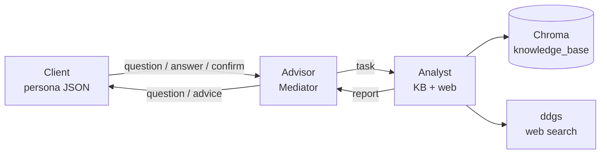
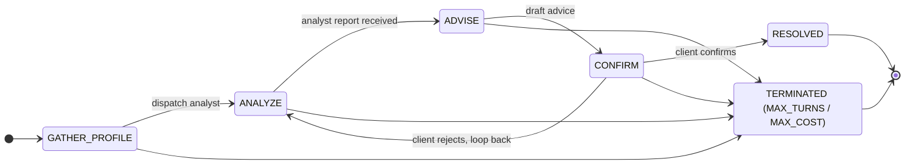

# JPM Multi-Agent Financial Advisor

A LangGraph-based multi-agent financial advisor. A **Client** agent (driven by a
persona JSON), an **Advisor** agent (the only mediator allowed to talk to both
sides), and an **Analyst** agent (with retrieval over a finance knowledge base
plus DuckDuckGo web search) collaborate over a hard-routed state machine to
produce a sourced, disclaimer-bearing recommendation that the client confirms or
rejects.

The runtime is provider-agnostic (OpenRouter, OpenAI, Anthropic, or local
Ollama), ships a Streamlit UI for live runs and human-in-loop sessions, and
includes an evaluation harness combining deterministic structural checks with
an LLM-as-judge rubric.

## Try it now

**Live demo:** [https://jpm-advisor-agent.streamlit.app](https://jpm-advisor-agent.streamlit.app)

The deployment runs the same code as `main`. Pick a persona, click *Run*, and
watch all three agents collaborate. Provider/model/key are configurable from
the sidebar — bring your own to try Opus, Sonnet, GPT-4o, or any OpenRouter
model. A *Human-in-loop* mode lets you type as the client; a *Persona editor*
lets you build a new client profile in the browser.

## Architecture



Routing is enforced at the **schema** level: `AgentMessage` rejects any
`(sender, recipient)` pair outside the allow-list. The Analyst literally
cannot send a message to the Client even if a buggy node tried — the only
legal paths are the six edges above.



While in `GATHER_PROFILE` the advisor may ask several follow-up questions
before dispatching the analyst — same state, no transition. Any state can
transition to `TERMINATED` when `MAX_TURNS=20` or `MAX_TOTAL_COST_USD=$2.00`
is breached.

## Design patterns

| Pattern        | Where it lives                              | Purpose |
| ---            | ---                                         | --- |
| **Mediator**   | `src/agents/advisor.py`                      | Advisor mediates between Client and Analyst; the only legal path between them. |
| **Strategy**   | `src/strategies/risk_profile.py`             | `RiskStrategy` with `Conservative` / `Moderate` / `Aggressive` concrete classes; selected at runtime by `client_profile.risk_tolerance`. |
| **Factory**    | `src/factories/agent_factory.py`             | `AgentFactory.create(role, config)` constructs the right agent + wires its LLM and tools, with lazy concrete imports. |
| **Observer**   | `src/observability/logger.py`                | `TurnLogger` records each turn as a structured JSON record; `export_transcript` renders the conversation as markdown. |
| **State machine** | `src/graph/state.py`, `src/graph/routing.py`, `src/graph/builder.py` | Explicit `ConversationStatus` enum drives routing through the LangGraph `StateGraph`. |

## Engineering highlights

Non-obvious decisions worth surfacing for review:

- **Schema-level routing**. The `(sender, recipient)` allow-list lives on the
  Pydantic `AgentMessage` validator (`src/schemas/messages.py`). Any agent
  attempt to bypass routing fails before the message reaches the graph — the
  invariant is enforced by construction, not by convention.
- **Provider abstraction with cost tracking**. `LLMProvider` in
  `src/providers/llm.py` defines a single contract (`complete()`,
  `last_usage`, cumulative counters). Four implementations slot in:
  `OpenRouterLLM`, `OpenAILLM`, `AnthropicLLM`, `OllamaLLM`. Token + cost
  accounting funnels into `TurnLogger.summary()` and the `MAX_TOTAL_COST_USD`
  guardrail; the per-conversation cap can actually trip in practice.
- **JSON-mode fallback**. Some OpenRouter free-tier providers (e.g.
  SiliconFlow) reject `response_format=json_object` with a 400. The provider
  catches the specific error and retries once without the constraint;
  `tenacity` is configured to treat the json-mode error as permanent so it
  doesn't waste 3 retries. The advisor's parser tolerates loose JSON
  (markdown fences, prose-wrapped objects) so the conversation still
  progresses.
- **Cooperative interruption**. The Streamlit *Stop* button flips a flag
  inside a shared `holder` dict; the graph runner thread checks it between
  `graph.stream()` yields and exits cleanly. Switching modes signals the
  same flag so an in-flight run doesn't bleed into the next conversation.
- **Cross-thread state passing in Streamlit**. `st.session_state` is
  thread-local — writes from a worker thread don't reach the main render
  thread. The runner publishes to a regular Python dict held by reference
  in session_state; mutations are visible across threads under the GIL.
- **Markdown safety for LLM output**. Streamlit's KaTeX extension grabs
  `$...$` as inline math regardless of the markdown `\$` escape, mangling
  dollar amounts in financial advice. The fix is to emit `&#36;` (HTML
  entity) and pre-escape `<>&` so LLM-emitted markup can't slip through
  with `unsafe_allow_html=True`. The same escapes apply to `~~` (GFM
  strikethrough) and to the saved `.md` transcript so it's portable.
- **Advisor circuit breaker**. Weaker models occasionally loop on the
  default `ask_client` action when the JSON parser falls through. The
  advisor counts consecutive `ask_client` turns at the tail of the
  conversation and force-overrides to `dispatch_analyst` after 2; the
  override is recorded in `state.errors` for visibility.
- **Thread-safe queue for human-in-loop**. The `HumanClientAgent`
  subclass replaces `_respond_to_question` / `_respond_to_advice` with
  blocking reads on a `queue.Queue`. The graph thread blocks on user
  input; the UI thread unblocks on form submit. State machine semantics
  (`CONFIRM`/`REJECT`) are preserved.

## Quick start

```bash
# 1. Create and activate a virtual environment
python3.11 -m venv .venv
source .venv/bin/activate

# 2. Install dependencies (runtime only — see requirements-dev.txt for tests)
pip install -r requirements.txt

# 3. Configure environment (only needed for live runs)
cp .env.example .env
# edit .env and set OPENROUTER_API_KEY=...

# 4. Run a sample conversation via CLI
python -m src.main --persona david
# or all three personas:
python -m src.main --all

# 5. Or launch the Streamlit UI locally
streamlit run app.py

# 6. Or run the evaluation harness
python -m src.eval --personas all --n 1 --judge fake
```

The CLI runner writes to `examples/sample_conversation_<persona>.md`. The
eval harness writes to `evals/reports/<timestamp>/`. Tests do not require an
API key (they use a `FakeLLM` and a `FakeEmbedder`).

## LLM providers

The runtime uses an `LLMProvider` interface; pick one via the `LLM_PROVIDER`
env var. Each provider reads its own credentials.

| `LLM_PROVIDER`         | Credential          | Default model              | Notes |
| ---                    | ---                 | ---                        | --- |
| `openrouter` (default) | `OPENROUTER_API_KEY`| `anthropic/claude-sonnet-4`| Multi-model gateway, single key. |
| `openai`               | `OPENAI_API_KEY`    | `gpt-4o-mini`              | Native OpenAI Chat Completions API. |
| `anthropic`            | `ANTHROPIC_API_KEY` | `claude-sonnet-4-6`        | Native Anthropic Messages API; better tool-use + native prompt caching. |
| `ollama`               | (none — local)      | `llama3.1:8b`              | Talks to `OLLAMA_BASE_URL`; zero cost, works offline. |

Embeddings have an analogous `EMBEDDING_PROVIDER` env var: `auto` (default —
OpenRouter if a key is present, else local sentence-transformers),
`openrouter`, `openai`, or `local`. See `.env.example` for all knobs.

## Streamlit UI (`app.py`)

Three modes selectable from a top-of-page segmented control (visible on
mobile where the sidebar collapses):

1. **Watch persona run** — pick a built-in persona (Margaret / David /
   Priya) or a custom one from the editor, click Run, and watch the live
   transcript stream agent-by-agent. Token and cost meters update per turn.
   A *Stop* button cooperatively interrupts a run between turns. Markdown
   and JSON download buttons appear after each conversation.
2. **Human-in-loop** — you become the Client. The Advisor and Analyst stay
   LLM-driven; whenever the graph needs the Client to speak, the UI shows
   the advisor's question and waits for you to type (Enter to send). Plain
   "yes/no" replies are normalized to `[CONFIRM]`/`[REJECT]`.
3. **Persona editor** — form-based editor for `ClientProfile` JSON (age,
   risk tolerance, assets, investments, goals, income). Validate, save to
   `data/personas/<key>.json`, or "Use as active" to feed the other modes.
   A `🆕 Blank` button starts a fresh persona from a sensible template.

Provider, model, and API key can be switched live from the sidebar — the
app writes to the relevant env vars before constructing the LLM, so you can
A/B OpenRouter / OpenAI / Anthropic / Ollama against the same persona
without restarting.

## Evaluation harness (`python -m src.eval`)

```bash
# Offline CI run with a canned-score judge:
python -m src.eval --personas all --n 1 --judge fake

# Real run with the same provider as the main LLM acting as judge:
python -m src.eval --personas all --n 2 --judge same

# Real run with a specific judge model id:
python -m src.eval --personas david,priya --n 3 --judge claude-sonnet-4-6
```

Each run produces `evals/reports/<timestamp>/`:

- `results.json` — the full per-run record (state, transcript, checks, judge).
- `report.md` — a human-readable summary with a pass/fail table, aggregates,
  judge-score histogram, and any failure detail.

**Deterministic checks** (in `src/eval/deterministic.py`) reuse the same
predicates the runtime uses for guardrails: conversation reached `RESOLVED`,
all three agent roles spoke, disclaimer present, no PII patterns leaked
into any message, no banned phrases, no named tickers, analyst cited
sources, cost under budget, `state.errors` clean.

**LLM-as-judge** (in `src/eval/judge.py`) scores 1–5 on a five-criterion
rubric: `risk_alignment`, `goal_alignment`, `specificity`, `coherence`,
`safety`. Uses the chosen `LLMProvider`, so any provider can act as judge
(useful for cross-provider quality comparisons).

## Guardrails

| Guardrail                | Where                                    | What it blocks |
| ---                      | ---                                      | --- |
| **PII redaction**        | `src/guardrails/pii.py`                   | SSNs, credit-card numbers, account numbers, emails, US phone numbers. Redacts before any LLM call; logs redaction counts. |
| **Output filter**        | `src/guardrails/output_filter.py`         | Banned phrases ("guaranteed return", "risk-free", "can't lose"), specific stock tickers (with whitelist for IRA/HSA/etc.), and force-appends the standard "this is not financial advice" disclaimer. |
| **Hard limits**          | `src/guardrails/limits.py`                | `MAX_TURNS=20`, `MAX_TOTAL_COST_USD=$2.00`, `MAX_TOKENS_PER_CALL=4000`, 60s per-call timeout. Breaches mark `status=TERMINATED`. |
| **Routing constraint**   | `src/schemas/messages.py`                 | `AgentMessage` validator rejects any sender/recipient pair outside the allow-list — Analyst cannot directly message Client. |

## Testing

```bash
pip install -r requirements.txt -r requirements-dev.txt
pytest --cov=src
```

**196 tests, ~91 % line coverage**, fully offline. `FakeLLM` and
`FakeEmbedder` fixtures in `tests/conftest.py` mean no network or API key
is required — CI-friendly. Test categories:

- **Schemas** (17): routing constraint rejects illegal pairs; profile
  validation; advice schema enforces disclaimer.
- **Agents** (21): each agent's decision logic, JSON-parse fallback,
  state-machine transitions.
- **Guardrails** (25): PII detected/missed, banned phrases caught,
  disclaimer enforcement, hard-limit trips.
- **Graph** (integration): full conversation against `FakeLLM` for each
  persona, infinite-loop prevention via `MAX_TURNS`, cost-limit
  termination.
- **Eval harness** (32): each deterministic check pass + fail, judge
  parser tolerance, runner smoke test.
- **UI** (15): UITurnLogger callback firing, queue-backed
  HumanClientAgent, persona editor round-trip.
- **Providers** (21): each provider's usage tracking, dispatcher per env
  var, JSON-mode fallback, cost estimator.

## Trade-offs and limitations

- **Dummy data, no live market access.** The knowledge base is six
  hand-written finance markdown documents; web search uses DuckDuckGo with
  no rate-limit or paid API. There is no real-time pricing, no portfolio
  holdings ingestion, and no broker integration. The advice is
  principle-level, not actionable trades.
- **Single-conversation only.** No persistence of state across runs; no
  multi-tenant session memory. Each invocation starts fresh.
- **Streamlit UI is single-user, single-session.** No auth, no concurrent
  sessions, no persistent history. The graph runs in a daemon thread; the
  current implementation polls for state changes via short timed reruns
  (~600 ms), which is good enough for a demo but would lose events under
  load. A FastAPI + WebSocket backend would scale better.
- **Async web search is a thin shim.** `WebSearchProvider.search_async`
  runs the sync `ddgs` call on a worker thread via `asyncio.to_thread`
  rather than using a native async HTTP client. Satisfies the spec's
  interface requirement but doesn't deliver real concurrency — only
  matters once the analyst issues multiple parallel searches, which it
  doesn't today.
- **Output filter is best-effort.** The named-ticker regex is a crude
  letter-string heuristic with a whitelist; a determined LLM could probably
  smuggle a ticker. The right long-term answer is a model fine-tuned to
  refuse, combined with a structured-output schema.
- **Confidence score is heuristic.** It's a 1/(1+distance) blend of
  similarity scores plus a small bump for web-augmented results. Treat it
  as a relative signal, not a calibrated probability.
- **No live OpenRouter test in CI.** All LLM tests use `FakeLLM`; all
  embedding tests use a deterministic hash embedder. The OpenRouter wiring
  is exercised only by integration smoke (mocked) and by manual runs and
  the live deployment.
- **Eval-harness scope.** The deterministic checks reuse the same regex
  and guardrail predicates the runtime uses, so they catch the same things
  — they do not catch novel LLM failure modes (jailbreaks, persona drift).
  The judge rubric does not evaluate factual correctness of specific
  numerical claims.
- **Cost estimation is heuristic.** Token counts come from each provider's
  `usage` field, but per-token prices come from a small in-process table
  (`MODEL_PRICES` in `src/providers/llm.py`) that may drift from current
  pricing. Treat the cost summary as a sanity check, not an invoice.

## Future work

- Stream token-level output so the user can watch the conversation unfold
  per-token rather than per-turn.
- Persist conversations and retrieve prior context via the LangGraph
  checkpointer (already a peer dependency).
- Add a richer `ClientProfile` (account types, tax brackets, dependents)
  and use it to bias the strategy beyond the three categorical labels.
- Replace the Streamlit poll loop with native LangGraph streaming
  (`graph.astream()`) so the UI doesn't need a separate worker thread.
- Add `streamlit.testing` coverage for the UI itself (currently only the
  UI helpers are unit-tested; full page rendering is not).
- Persist eval reports to a comparable schema across providers so you can
  chart judge-score deltas between, say, GPT-4o-mini and Claude Sonnet on
  the same personas.
- Build a thin FastAPI surface for embedding the agent in a chat UI and
  enable multi-tenant sessions.
- Refresh the `MODEL_PRICES` table automatically (e.g., from OpenRouter's
  pricing API) instead of hand-maintaining it.
- Replace the named-ticker regex with a structured-output schema that
  prevents ticker mentions at the model level.

## Project layout

```
src/
├── agents/           # base, client, advisor, analyst
├── eval/             # runner, deterministic checks, LLM-as-judge, report writer
├── factories/        # agent_factory
├── graph/            # state, routing, builder
├── guardrails/       # pii, output_filter, limits
├── observability/    # logger
├── providers/        # llm (openrouter, openai, anthropic, ollama), embeddings
├── schemas/          # messages, client_profile, advice
├── strategies/       # risk_profile
├── tools/            # web_search, knowledge_store, ingest CLI
├── ui/               # streaming logger, human-client agent, persona editor
└── main.py
app.py                # Streamlit entry point — three-mode UI
data/
├── knowledge_base/   # 6 finance markdown docs
└── personas/         # 3 persona JSONs (Margaret / David / Priya)
tests/                # 196 tests, offline
examples/             # generated sample_conversation_<persona>.md
evals/reports/        # generated eval results (results.json + report.md)
```

## Sample conversation snippet

> **Client:** Hi, I'm David Patel. I'm 42 and I'd like help with my finances.
>
> **Advisor → Analyst (task):** Research a sensible portfolio for a
> moderate-risk 42-year-old with an 18-year horizon, including target
> allocation and tax-advantaged account guidance.
>
> **Analyst → Advisor (report, confidence 0.47):** Standard planning
> principles support a balanced allocation appropriate to the client risk
> tolerance and time horizon … (sources: `01_asset_allocation.md`,
> `05_tax_advantaged_accounts.md`).
>
> **Advisor → Client (advice):** Target allocation: 65 % equities / 30 %
> bonds / 5 % cash. Diversify equities globally; use tax-advantaged
> accounts first (401(k) match → HSA → IRA → remaining 401(k)). Rebalance
> annually …
> *Disclaimer: this is not financial advice.*
>
> **Client → Advisor:** [CONFIRM] this matches my goals — appreciate the
> breakdown.

Full transcripts:
[`margaret`](examples/sample_conversation_margaret.md),
[`david`](examples/sample_conversation_david.md),
[`priya`](examples/sample_conversation_priya.md). Or click *Run* on the
[live demo](https://jpm-advisor-agent.streamlit.app) and watch your own.

## Deployment

The app is deployed on Streamlit Community Cloud at
[jpm-advisor-agent.streamlit.app](https://jpm-advisor-agent.streamlit.app).
The OpenRouter key lives only in Streamlit's secrets store — never in git,
never visible to clients. Visitors who want to use a different model just
paste their own key in the sidebar (it overrides the deployer's for that
session).

To self-host the same app:

```toml
# Streamlit Cloud → Settings → Secrets
OPENROUTER_API_KEY = "<your-key>"
LLM_PROVIDER = "openrouter"
LLM_MODEL = "anthropic/claude-sonnet-4-6"
EMBEDDING_PROVIDER = "local"
```

The repo also ships `runtime.txt` (`python-3.11`) and a tightened
`requires-python = ">=3.11,<3.14"` — Streamlit Cloud's default Python 3.14
has no wheels for `zstandard==0.23.0` (a transitive dep), so pinning to
3.11 sidesteps a build failure.

For other platforms (Render / Fly.io / VPS / Cloudflare Tunnel), the app
is a plain Python process — `streamlit run app.py --server.port $PORT`.
Plain Cloudflare Pages/Workers can't host a Python server.

Set a hard credit cap on the OpenRouter key in the dashboard (e.g.
$30/mo). The runtime also enforces `MAX_TOTAL_COST_USD=$2.00` per
conversation. Worst case for an open demo is the credit cap getting hit;
further requests fail fast until the cap resets.
