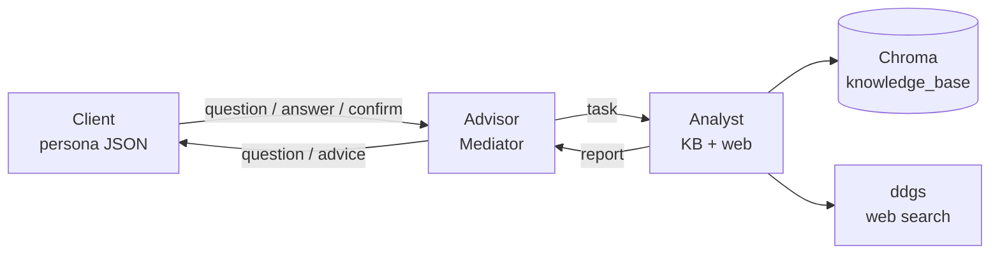
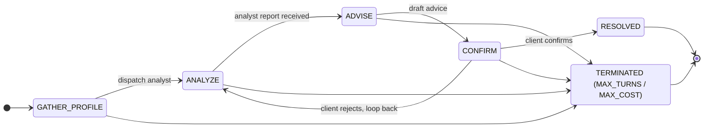

# JPM Multi-Agent Financial Advisor

A LangGraph-based multi-agent financial advisor. A **Client** agent (driven by a
persona JSON), an **Advisor** agent (the only mediator allowed to talk to both
sides), and an **Analyst** agent (with retrieval over a finance knowledge base
plus DuckDuckGo web search) collaborate over a hard-routed state machine to
produce a sourced, disclaimer-bearing recommendation that the client confirms or
rejects.

The runtime is provider-agnostic (OpenRouter, OpenAI, Anthropic, or local
Ollama), ships a Streamlit UI for live runs and human-in-loop sessions, and
includes an evaluation harness combining deterministic structural checks with
an LLM-as-judge rubric.

## Architecture



Routing is enforced at the **schema** level: `AgentMessage` rejects any
sender/recipient pair outside the allow-list. The Analyst literally cannot
message the Client even if a buggy node tried — the only legal paths are the
six edges above.



While in `GATHER_PROFILE` the advisor may ask several follow-up questions
before dispatching the analyst — same state, no transition. Any state can
transition to `TERMINATED` when `MAX_TURNS=20` or `MAX_TOTAL_COST_USD=$2.00`
is breached.

Routing is enforced at the **schema** level: `AgentMessage` rejects any
`(sender, recipient)` pair outside the allow-list, so the Analyst literally
cannot send a message to the Client even if a buggy node tried.

## Setup

```bash
# 1. Create and activate a virtual environment
python3.11 -m venv .venv
source .venv/bin/activate

# 2. Install dependencies
pip install -r requirements.txt

# 3. Configure environment (only needed for live runs)
cp .env.example .env
# edit .env and set OPENROUTER_API_KEY=...

# 4. (Optional) Pre-ingest the knowledge base — done lazily on first run too
python -m src.tools.ingest --reset

# 5. Run a sample conversation
python -m src.main --persona david
# or all three:
python -m src.main --all

# 6. Or launch the Streamlit UI
streamlit run app.py

# 7. Or run the evaluation harness
python -m src.eval --personas all --n 1 --judge fake
```

The CLI runner writes to `examples/sample_conversation_<persona>.md`. The eval
harness writes to `evals/reports/<timestamp>/`. Tests do not require an API key
(they use a `FakeLLM` and a `FakeEmbedder`).

## LLM providers

The runtime uses an `LLMProvider` interface; pick one via the `LLM_PROVIDER`
env var. Each provider reads its own credentials.

| `LLM_PROVIDER`  | Credential          | Default model              | Notes |
| ---             | ---                 | ---                        | --- |
| `openrouter` (default) | `OPENROUTER_API_KEY` | `anthropic/claude-sonnet-4` | Multi-model gateway, single key. |
| `openai`        | `OPENAI_API_KEY`    | `gpt-4o-mini`              | Native OpenAI Chat Completions API. |
| `anthropic`     | `ANTHROPIC_API_KEY` | `claude-sonnet-4-6`        | Native Anthropic Messages API; better tool-use + native prompt caching. |
| `ollama`        | (none — local)      | `llama3.1:8b`              | Talks to `OLLAMA_BASE_URL`; zero cost, works offline. |

Embeddings have an analogous `EMBEDDING_PROVIDER` env var: `auto` (default —
OpenRouter if a key is present, else local sentence-transformers), `openrouter`,
`openai`, or `local`. See `.env.example` for all knobs.

## Streamlit UI

Run `streamlit run app.py` to open a three-mode UI:

1. **Watch persona run** — pick a built-in persona (`margaret` / `david` /
   `priya`) or a custom one from the editor, click Run, and watch the live
   transcript stream agent-by-agent. Token and cost meters update per turn.
2. **Human-in-loop** — you become the Client. The Advisor and Analyst stay
   LLM-driven; whenever the graph needs the Client to speak, the UI shows the
   advisor's question and waits for you to type. Plain "yes/no" replies are
   normalized to `[CONFIRM]`/`[REJECT]`.
3. **Persona editor** — form-based editor for `ClientProfile` JSON (age, risk
   tolerance, assets, investments, goals, income). Validate, save to
   `data/personas/<key>.json`, or "Use as active" to feed the other modes.

Provider and model can be switched live from the sidebar — the app writes to
the relevant env vars before constructing the LLM, so you can A/B
OpenRouter/OpenAI/Anthropic/Ollama against the same persona without restarting.

## Deployment

The Streamlit app can be deployed publicly. Two safeguards are built in for
public demos:

1. **`APP_PASSWORD` gate.** Set the env var (or a Streamlit Cloud secret) and
   the app shows a password screen before any agent code runs. Comparison is
   timing-safe (`hmac.compare_digest`). Sign-out is in the sidebar.
2. **Free-tier OpenRouter key.** Create a *separate* OpenRouter key with a
   small credit limit and restrict it to the `:free` model variants
   (Llama 3.1 8B, Gemma 2 9B, Mistral 7B, Qwen 2 7B — all in the curated
   dropdown). On openrouter.ai → *Keys*, set "Credit limit" and add allowed
   models. If a visitor pastes their own key in the sidebar, that overrides
   the deployer's key for their session — they pay for their own usage.

### Streamlit Community Cloud (recommended)

1. Push the repo to GitHub (already done).
2. Go to https://share.streamlit.io and pick this repo + `app.py`.
3. In the app's *Settings → Secrets*, add:
   ```toml
   APP_PASSWORD = "pick-a-strong-password"
   OPENROUTER_API_KEY = "<your-restricted-free-tier-key>"
   LLM_PROVIDER = "openrouter"
   LLM_MODEL = "meta-llama/llama-3.1-8b-instruct:free"
   EMBEDDING_PROVIDER = "local"  # avoid burning credits on embeddings
   ```
4. Click *Deploy*. ~2 minutes; the app rebuilds automatically on every push.

### Self-host (Render / Fly.io / VPS)

The app is a plain Python process — `streamlit run app.py --server.port $PORT`.
Any platform that runs a long-lived Python container with WebSocket support
will work. Use the same env vars as above. For Cloudflare integration, run
Streamlit on your own machine and front it with `cloudflared tunnel` — plain
Cloudflare Pages/Workers can't host a Python server.

### Cost protection beyond the password

`MAX_TOTAL_COST_USD=$2.00` per conversation is enforced by the runtime
regardless of provider. Combined with a $5–10/mo OpenRouter credit cap on the
shared key, the worst-case bill for an open demo is bounded.

## Evaluation harness

```bash
# Offline CI run with a canned-score judge (no API key required for the judge):
python -m src.eval --personas all --n 1 --judge fake

# Real run with the same provider as the main LLM acting as judge:
python -m src.eval --personas all --n 2 --judge same

# Real run with a specific judge model id:
python -m src.eval --personas david,priya --n 3 --judge claude-sonnet-4-6
```

Each run produces `evals/reports/<timestamp>/`:

- `results.json` — the full per-run record (state, transcript, checks, judge).
- `report.md` — a human-readable summary with a pass/fail table, aggregates,
  judge-score histogram, and any failure detail.

**Deterministic checks** (in `src/eval/deterministic.py`): conversation reached
`RESOLVED`, all three agent roles spoke, disclaimer present, no PII patterns
leaked into any message, no banned phrases, no named tickers, analyst cited
sources, cost under budget, `state.errors` clean.

**LLM-as-judge** (in `src/eval/judge.py`): rubric-based 1–5 scores on
`risk_alignment`, `goal_alignment`, `specificity`, `coherence`, `safety`. Uses
the chosen `LLMProvider`, so any provider can act as judge.

## Sample conversation snippet

> **Client:** Hi, I'm David Patel. I'm 42 and I'd like help with my finances.
>
> **Advisor → Analyst (task):** Research a sensible portfolio for a
> moderate-risk 42-year-old with an 18-year horizon, including target allocation
> and tax-advantaged account guidance.
>
> **Analyst → Advisor (report, confidence 0.47):** Standard planning principles
> support a balanced allocation appropriate to the client risk tolerance and
> time horizon … (sources: `01_asset_allocation.md`, `05_tax_advantaged_accounts.md`).
>
> **Advisor → Client (advice):** Target allocation: 65% equities / 30% bonds /
> 5% cash. Diversify equities globally; use tax-advantaged accounts first
> (401(k) match → HSA → IRA → remaining 401(k)). Rebalance annually …
> *Disclaimer: this is not financial advice.*
>
> **Client → Advisor:** [CONFIRM] this matches my goals — appreciate the breakdown.

Full transcripts: [`examples/sample_conversation_margaret.md`](examples/sample_conversation_margaret.md),
[`david`](examples/sample_conversation_david.md),
[`priya`](examples/sample_conversation_priya.md).

## Design Patterns

| Pattern        | Where it lives                              | Purpose |
| ---            | ---                                         | --- |
| **Mediator**   | `src/agents/advisor.py`                      | Advisor mediates between Client and Analyst; the only legal path between them. |
| **Strategy**   | `src/strategies/risk_profile.py`             | `RiskStrategy` with `Conservative` / `Moderate` / `Aggressive` concrete classes; selected at runtime by `client_profile.risk_tolerance`. |
| **Factory**    | `src/factories/agent_factory.py`             | `AgentFactory.create(role, config)` constructs the right agent + wires its LLM and tools, with lazy concrete imports. |
| **Observer**   | `src/observability/logger.py`                | `TurnLogger` records each turn as a structured JSON record; `export_transcript` renders the conversation as markdown. |
| **State machine** | `src/graph/state.py`, `src/graph/routing.py`, `src/graph/builder.py` | Explicit `ConversationStatus` enum drives routing through the LangGraph `StateGraph`. |

## Guardrails

| Guardrail                | Where                                    | What it blocks |
| ---                      | ---                                      | --- |
| **PII redaction**        | `src/guardrails/pii.py`                   | SSNs, credit-card numbers, account numbers, emails, US phone numbers. Redacts before any LLM call; logs redaction counts. |
| **Output filter**        | `src/guardrails/output_filter.py`         | Banned phrases ("guaranteed return", "risk-free", "can't lose"), specific stock tickers (with whitelist for IRA/HSA/etc.), and force-appends the standard "this is not financial advice" disclaimer. |
| **Hard limits**          | `src/guardrails/limits.py`                | `MAX_TURNS=20`, `MAX_TOTAL_COST_USD=$2.00`, `MAX_TOKENS_PER_CALL=4000`, 60s per-call timeout. Breaches mark `status=TERMINATED`. |
| **Routing constraint**   | `src/schemas/messages.py`                 | `AgentMessage` validator rejects any sender/recipient pair outside the allow-list — Analyst cannot directly message Client. |

## Trade-offs and Limitations

- **Dummy data, no live market access.** The knowledge base is six hand-written
  finance markdown documents; web search uses DuckDuckGo with no rate-limit or
  paid API. There is no real-time pricing, no portfolio holdings ingestion, and
  no broker integration. The advice is principle-level, not actionable trades.
- **Single-conversation only.** No persistence of state across runs; no
  multi-tenant session memory. Each invocation starts fresh.
- **Streamlit UI is single-user, single-session.** No auth, no concurrent
  sessions, no persistent history. The graph runs in a daemon thread; the
  current implementation polls for state changes via short timed reruns
  (~600 ms), which is good enough for a demo but would lose events under load.
  A FastAPI + WebSocket backend would scale better.
- **Eval harness scope.** The deterministic checks reuse the same regex and
  guardrail predicates the runtime uses, so they catch the same things — they
  do not catch novel LLM failure modes (jailbreaks, persona drift). The judge
  rubric is five criteria scored 1–5; it does not evaluate factual correctness
  of specific numerical claims.
- **Async web search is a thin shim.** `WebSearchProvider.search_async` runs
  the sync `ddgs` call on a worker thread via `asyncio.to_thread` rather than
  using a native async HTTP client. Satisfies the spec's interface requirement
  but doesn't deliver real concurrency — only matters once the analyst issues
  multiple parallel searches, which it doesn't today.
- **Output filter is best-effort.** The named-ticker regex is a crude
  letter-string heuristic with a whitelist; a determined LLM could probably
  smuggle a ticker. The right long-term answer is a model fine-tuned to refuse,
  combined with a structured-output schema.
- **Confidence score is heuristic.** It's a 1/(1+distance) blend of similarity
  scores plus a small bump for web-augmented results. Treat it as a relative
  signal, not a calibrated probability.
- **No test for the live OpenRouter path.** All LLM tests use `FakeLLM`; all
  embedding tests use a deterministic hash embedder. The OpenRouter wiring is
  exercised only by integration smoke (mocked) and by manual runs.
- **Cost estimation is heuristic.** Token counts come from the OpenRouter
  `usage` field, but per-token prices come from a small in-process table
  (`MODEL_PRICES` in `src/providers/llm.py`) that may drift from current
  pricing. Treat the cost summary as a sanity check, not an invoice.

## Future Work

- Stream token-level output so the user can watch the conversation unfold
  rather than waiting for the full graph to terminate.
- Persist conversations and retrieve prior context via the LangGraph
  checkpointer (already a peer dependency).
- Add a richer `ClientProfile` (account types, tax brackets, dependents) and
  use it to bias the strategy beyond the three categorical labels.
- Replace the Streamlit poll loop with native LangGraph streaming
  (`graph.astream()`) so the UI doesn't need a separate worker thread.
- Add `streamlit.testing` coverage for the UI itself (currently only the UI
  helpers are unit-tested; full page rendering is not).
- Persist eval reports to a comparable schema across providers so you can chart
  judge-score deltas between, say, GPT-4o-mini and Claude Sonnet on the same
  personas.
- Build a thin FastAPI surface for embedding the agent in a chat UI.
- Refresh the `MODEL_PRICES` table automatically (e.g., from OpenRouter's
  pricing API) instead of hand-maintaining it.
- Replace the named-ticker regex with a structured-output schema that prevents
  ticker mentions at the model level.

## Testing

```bash
.venv/bin/pytest --cov=src
```

The suite is offline by design — `FakeLLM` and `FakeEmbedder` fixtures in
`tests/conftest.py` mean no network or API key is required. CI-friendly.

## Project Layout

```
src/
├── agents/           # base, client, advisor, analyst
├── eval/             # runner, deterministic checks, LLM-as-judge, report writer
├── factories/        # agent_factory
├── graph/            # state, routing, builder
├── guardrails/       # pii, output_filter, limits
├── observability/    # logger
├── providers/        # llm (openrouter, openai, anthropic, ollama), embeddings
├── schemas/          # messages, client_profile, advice
├── strategies/       # risk_profile
├── tools/            # web_search, knowledge_store, ingest CLI
├── ui/               # streaming logger, human-client agent, persona editor
└── main.py
app.py                # Streamlit entry point — three-mode UI
data/
├── knowledge_base/   # 6 finance markdown docs
└── personas/         # 3 persona JSONs (Margaret / David / Priya)
tests/                # 190 tests, offline
examples/             # generated sample_conversation_<persona>.md
evals/reports/        # generated eval results (results.json + report.md)
```
